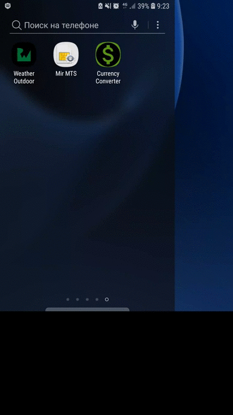

# currencyConverterSealedClass
An example of an application that uses a Kotlin sealed class for currency conversion.
Conversion factors are hardcodes. 

  

The application was created in order to see how you can use Kotlin sealed classes instead of enums.

